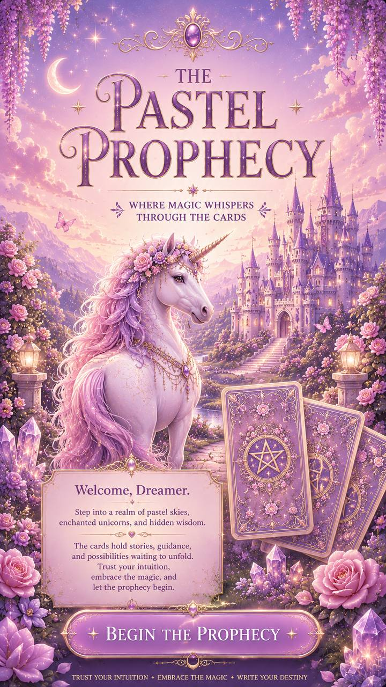

# The Pastel Prophecy



A mobile-first whimsical pastel tarot experience with dreamy visuals, multilingual readings, and a soft storybook feel.

## Live demo

- **Site:** https://helencablaza.github.io/pastel-prophecy/
- **Cache-bypass link:** https://helencablaza.github.io/pastel-prophecy/?nocache=1

## Highlights

- **78-card tarot deck** with original app data in `data/cards.js`
- **Full-screen illustrated flow:** Begin → Shuffle → Pick 3 → Reveal
- **Multilingual readings:** English, Thai, and German
- **English card names across all languages**
- **Top-right language switcher** with gold ombre flag buttons
- **Thai typography support** using `Prompt`
- **Download reading as PNG** via `html2canvas`
- **Tarot-authentic reading copy** with:
  - a brief summary for each card
  - one combined 3-card summary
  - one shared **Do** list and **Don't** list

## Language support

The app currently supports:

- **English** — default language
- **Thai** — localized UI and reading text, with `Prompt` for improved readability
- **German** — localized UI and reading text

### Language behavior

- UI text changes with the selected language
- Reading summaries and guidance change with the selected language
- **Card names remain in English** in every language
- Language switching re-renders the current reading in place

## Visual / mobile polish

Recent UI improvements include:

- fixed top-right language controls
- smaller rounded-rectangle flag buttons with a gold ombre treatment
- extra top spacing to prevent button/text overlap
- locked reveal background with internal result-panel scrolling
- softened result-screen ombre overlay for a lighter magical finish

## Project structure

- `index.html` — app screens and layout
- `style.css` — pastel visual system, layout, and animation
- `script.js` — reading flow, interaction logic, and rendering
- `data/cards.js` — tarot card data and English source meanings
- `data/localization.js` — UI strings and localized reading helpers
- `assets/` — backgrounds, start art, card backs, and card artwork
- `docs/` — design notes, prompts, and animation direction

## Local preview

```bash
python3 -m http.server 8000
```

Then open:

- <http://localhost:8000>

## Deploy (GitHub Pages)

This is a static app deployed from the `main` branch root.

## Cache-busting workflow

After frontend changes, bump the cache-busted asset versions in `index.html`:

- `style.css?v=N`
- `script.js?v=N`

If `script.js` imports cache-busted modules, bump those too, for example:

- `./data/cards.js?v=N`
- `./data/localization.js?v=N`

Then commit and push.

## Current live build

- `style.css?v=39`
- `script.js?v=83`
- `data/localization.js?v=3`

## Copyright & usage

**Copyright © Helen C Ablaza. All rights reserved.**

Unless Helen C Ablaza gives written permission, you may **not**:

- copy or republish the app's original artwork
- reuse the repository's custom visuals, branded presentation, or bespoke UI styling as your own
- redistribute the project as a template, kit, or commercial product
- reuse the app's original written copy, localized reading presentation, or curated implementation as a packaged derivative

### Notes

- Traditional tarot systems, card titles, and general correspondences are historical/common references and are not claimed here as exclusive property.
- Original code, visual design choices, custom art direction, repository arrangement, and project-specific presentation in this repo are protected.
- Third-party libraries and services used by the project retain their own licenses and terms.

## Repository

- GitHub: https://github.com/HelenCAblaza/pastel-prophecy
